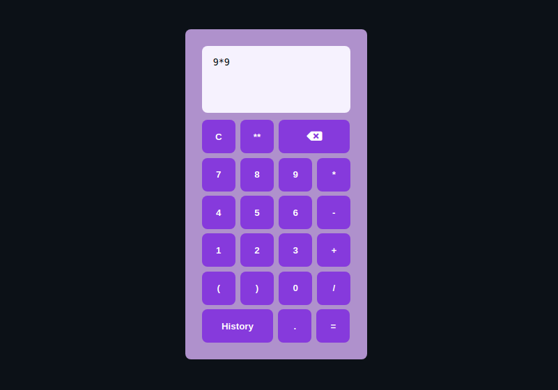

# Vue calculator

A while ago, I made a basic [calculator with angular](https://github.com/bellps/angular-calculator). The goal of this project were to make the exact same thing, but with Vue, to see how things can get reeeeally more simple with this beautiful framework. Also made my own css this time :D

